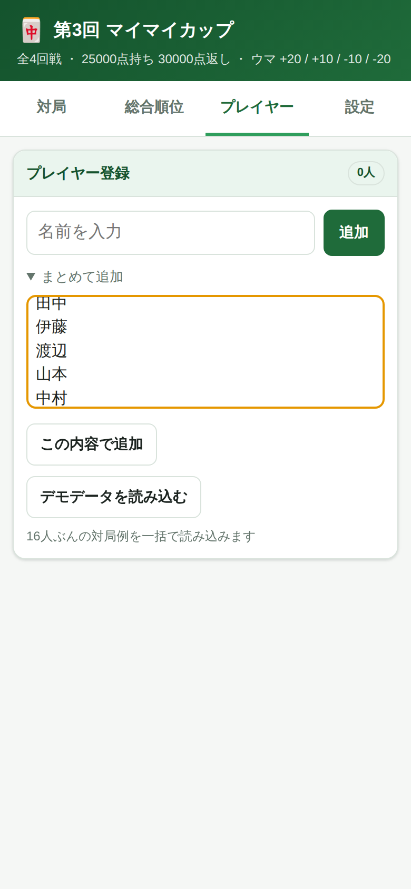
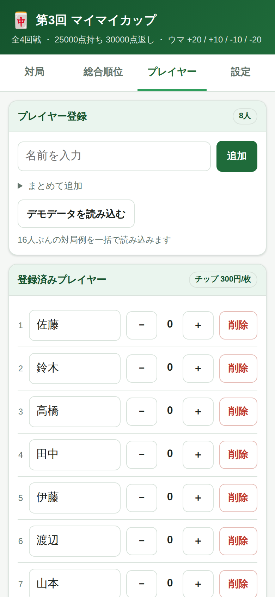
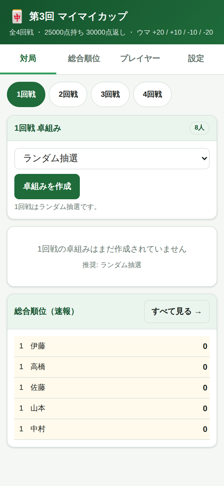
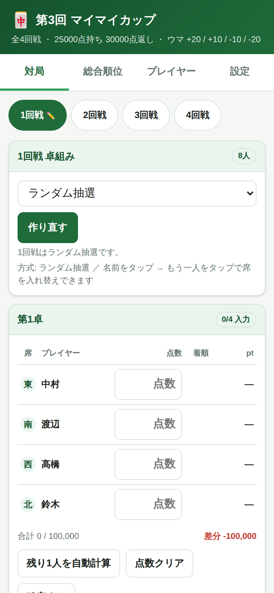
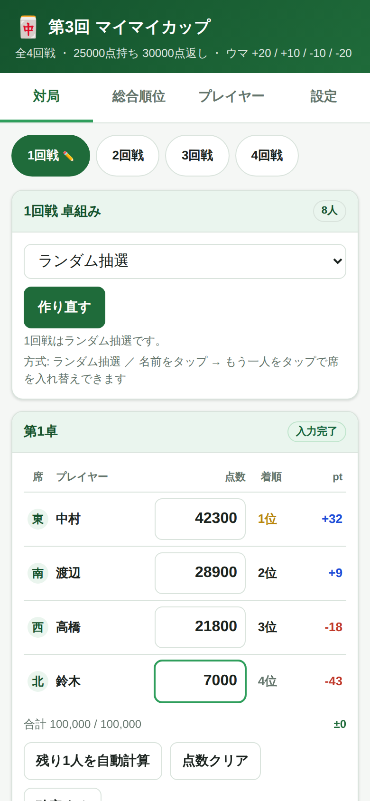
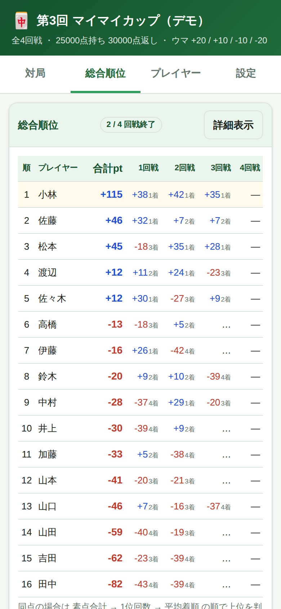
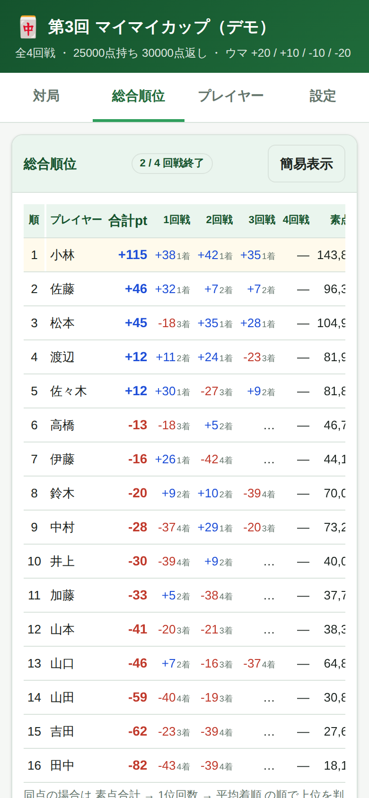
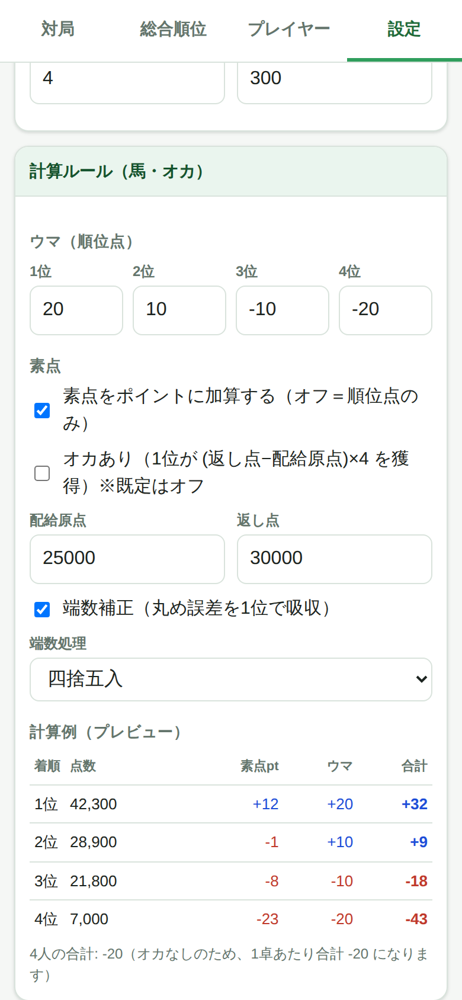

# 麻雀大会 スコア計算アプリ　使い方マニュアル

スマホのブラウザだけで、卓組みから順位計算まで完結します。アプリのインストールは不要です。

- **計算ルール**：素点（(最終点 − 30,000) ÷ 1000）＋ ウマ（1位 +20 / 2位 +10 / 3位 −10 / 4位 −20）
- **入力内容は自動保存**されます。画面を閉じても、間違って戻っても消えません。

---

## 目次

1. [はじめに（画面の見方）](#1-はじめに画面の見方)
2. [プレイヤーを登録する](#2-プレイヤーを登録する)
3. [卓組みを作る](#3-卓組みを作る)
4. [点数を入力する](#4-点数を入力する)
5. [総合順位を見る](#5-総合順位を見る)
6. [2回戦以降を進める](#6-2回戦以降を進める)
7. [ルールを変える](#7-ルールを変える)
8. [困ったときは](#8-困ったときは)

---

## 1. はじめに（画面の見方）


画面の上に4つのタブがあります。基本はこの順に使います。

| タブ | 役割 |
| --- | --- |
| **対局** | 卓組みの作成と、点数の入力 |
| **総合順位** | 全員の順位をリアルタイムで表示 |
| **プレイヤー** | 参加者の登録、チップの増減 |
| **設定** | ウマ・回戦数・賞金などの変更 |

> **まず試してみたいとき**
> 「デモデータを見る」を押すと、16人ぶんの大会例がすぐに表示されます。
> 操作を試してから本番データに入れ替えられます（本番で使うときは、
> 設定タブの「対局結果をリセット」で消してから始めてください）。

---

## 2. プレイヤーを登録する

**プレイヤー**タブを開きます。1人ずつ名前を入れて「追加」でも登録できますが、
人数が多いときは**まとめて追加**が早いです。



「まとめて追加」を開いて、名前を**改行区切り**で貼り付け →「この内容で追加」。

```
佐藤
鈴木
高橋
田中
```



登録すると一覧になります。ここでできること：

- **名前の修正**：名前欄を直接書き換える
- **チップの増減**：`−` `＋` ボタン（役満ボーナスやチョンボの記録に使います）
- **削除**：その人を大会から外す

> 人数が4の倍数でないときは警告が出ます。そのままでも進められて、
> あぶれた人は**自動で抜け番**になります（その回戦はポイント加算なし）。

---

## 3. 卓組みを作る

**対局**タブを開きます。



上の `1回戦` `2回戦` … で回戦を切り替えます。
**「卓組みを作成」**を押すだけで、その回戦にふさわしい方式で自動的に卓が決まります。

| 回戦 | 自動で選ばれる方式 |
| --- | --- |
| 1回戦 | **ランダム抽選** |
| 2回戦 | **順位卓**（1回戦の1位同士・2位同士…） |
| 3回戦以降 | **総合順位順**（1〜4位 / 5〜8位 …） |



席は East から順に **東・南・西・北** で表示されます。

> **席を手動で入れ替えたいとき**
> 名前をタップ → 入れ替えたい相手の名前をタップ。それだけで入れ替わります。
> 抜け番の人とも入れ替えられます。

> **やり直したいとき**
> 「作り直す」を押すと組み直せます。点数を入力済みの場合は確認が出ます。

---

## 4. 点数を入力する

終局後の持ち点を、そのまま入力します（例：`42300`）。



4人ぶん揃うと、**着順とポイントが自動で計算**されます。

- **合計 100,000 / 100,000** … 4人の合計が正しいかの確認。ズレていると赤字で差分が出ます
- **残り1人を自動計算** … 3人ぶん入れれば、4人目は自動で算出されます
- **確定する** … 入力を確定してロック。誤タップでの書き換えを防げます
- 右上のバッジが **「入力完了」** になれば、その卓は完了です

> 同点のときは**席順（東 → 南 → 西 → 北）が上位**になります。
> トビ（マイナス点）もそのまま入力できます。

---

## 5. 総合順位を見る

**総合順位**タブで、その時点の順位が見られます。点数を入力した瞬間に反映されます。



各回戦の欄の見方：

| 表示 | 意味 |
| --- | --- |
| `+38 1着` | その回戦のポイントと着順 |
| `…` | その卓はまだ入力の途中 |
| `—` | まだ対局していない |
| `抜` | 抜け番 |

右上の**「詳細表示」**を押すと、素点合計・平均着順・着順分布・チップ・賞金も表示されます。



> 同点の場合は **素点合計 → 1位回数 → 平均着順** の順で上位を判定します。
> 「CSVで書き出す」で、表計算ソフトに取り込める形式で保存できます。

---

## 6. 2回戦以降を進める

流れは1回戦と同じです。

1. 上の `2回戦` をタップ
2. 「卓組みを作成」を押す（方式は自動で**順位卓**が選ばれています）
3. 点数を入力


3回戦以降は**総合順位順**（1〜4位が同卓、5〜8位が同卓…）で自動的に組まれます。
回戦タブの ✅ は入力完了、✏️ は入力途中を表します。

---

## 7. ルールを変える

**設定**タブで、大会のルールをその場で変更できます。変更するとすべての計算がやり直されます。



| 項目 | 初期値 | 説明 |
| --- | --- | --- |
| ウマ | +20 / +10 / −10 / −20 | 順位点 |
| 素点をポイントに加算する | オン | オフにすると**順位点のみ**の計算になります |
| オカあり | **オフ** | オンにすると1位に +20pt が入ります |
| 配給原点 / 返し点 | 25,000 / 30,000 | 素点の基準 |
| 端数補正 | オン | 丸め誤差を1位で吸収します |
| 端数処理 | 四捨五入 | 五捨六入なども選べます |

一番下の**計算例（プレビュー）**で、変更した結果がその場で確認できます。

このほか、大会名・回戦数・チップ単価・賞金も変更できます。

---

## 8. 困ったときは

**Q. 入力した点数は消えませんか？**
消えません。同じ端末の同じブラウザで開けば、閉じても電源を切っても残ります。
念のため、設定タブの「バックアップ書き出し」でファイルに保存もできます。

**Q. 別のスマホでも同じ順位を見たい**
データは端末ごとに保存されるため、自動では共有されません。
「バックアップ書き出し」でファイルを渡し、相手側で「読み込み」してください。

**Q. 点数を間違えて入力した**
その卓の点数欄を書き直すだけです。順位は自動で計算し直されます。
「確定する」でロックしている場合は、もう一度押して解除してから修正します。

**Q. 合計が100,000点にならない**
差分が赤字で表示されます。そのままでも計算はできますが、
どこかで入力ミスの可能性が高いので確認してください。

**Q. 最初からやり直したい**
設定タブ →「対局結果をリセット」。プレイヤーは残り、対局結果とチップだけが消えます。

**Q. 参加者が4の倍数じゃない**
そのまま進められます。あぶれた人は自動で**抜け番**になり、
抜け番の回数が少ない人から優先的に選ばれます。
